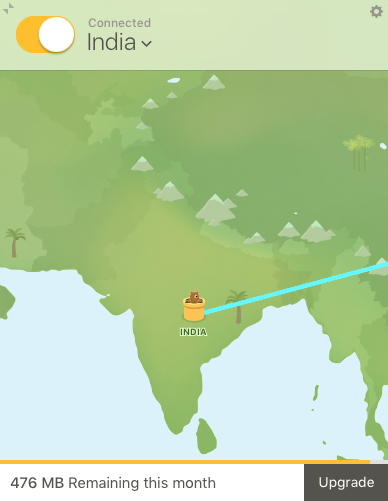

## Contents
> I spend a considerable amount of time on macOS, hence productivity is extremely critical. This repository consists of a list of applications I use on a regular basis.

- [Applications](#applications)
	- [Apple](#apple)
	- [Browsers](#browsers)
	- [Drawing](#drawing)
	- [Development](#development)
	- [Drive & VPN](#drive_vpn)
	- [Experimental](#experimental)
	- [Messenger](#messenger)
	- [Music](#music)
	- [Mail](#mail)
	- [Mac Essentials](#mac_essentials)
	- [Notes](#notes)
	- [Presentation](#presentation)
	- [Photos](#photos)
	- [Productivity](#productivity)
	- [Reminders](#reminders)
	- [Read](#read)
	- [Screen](#screen)
	- [System](#system)
	- [Security](#security)
	- [Office](#office)
	- [Text Editor](#text_editor)
- [Launchpad](#launchpad)
- [Contributions](#contributions)

# Applications
## Apple
> macOS comes loaded with many essential applications. I divide this list of built-in applications in two categories. One I don't use them at all like Chess and DVD player. Second I use them indirectly using some API for example like Dictionary and Contacts with an integration with Alfred. Overall I have categories applications such as System Preferences, App Store, Contacts, Maps, Game Center, Mission Control, Dashboard, Calculator, Dictionary, Terminal, Script Editor, ColorSync Utility, Chess, DVD Player in this list of applications.

## Browsers
> I try to use multiple browsers on my system depending upon use cases. Depending upon whether I just want to read some articles or I want to browse the web in general or browsing with perspective of security in mind, I try to use three different browsers. Following is the list of web browsers I use on my Mac.

  

#### [Safari][] - Best browser to read and general Browsing
When required to read some article with smooth and spontaneous reflex gestures on touchpad I try to stick on Safari. Preloaded in macOS, Safari is way better default browser compared to Internet Explorer on Windows. Although it has some awesome features, one direction Safari shortfalls to  Chrome is extensions. Although you can find some very famous extensions like Adblock or Translate for Safari still there are many other useful extensions which does not exist out there in Safari's library of extension.

#### [Chrome][] - Best browser for performance and extensions
Chrome is my way to go i.e. default browser on all my Macs. From my experience Chrome is by far the most customisable browser out there without substantial performance degradation with extensions. Although it consumes way more CPU and memory than Safari but still it is worth given its speed, list of extensions, customisability. I will make my point with the list of extensions I use almost in my daily routine, which make my experience with web, more smooth and efficient.

Following is the list of the plugins I use with Chrome.

* [AdBlock][] - For blocking adds.
	- For blocking pop-ups, advertisements on websites. Although works out of the box on most of the websites but recently many websites have gone a step further and ask to block the ad blocker in order to access the website. To avoid clicking on the extension every time to pause and resume the extension, I have assigned a dedicated keyboard shortcut `ctrl + shift + b` to activate this plugin.
* [Audio Only Youtube][] - Listen to audio only on youtube.
	- I often use Youtube Playlists to listen songs, these plugin helps me to reduce bandwidth consumed on streaming videos which I any ways am not watching while working. 
* [Dark Reader][] - Dark theme for every website.
	- I prefer black background with white foreground on almost all of my applications. Since browsing web is one of the task where I spend considerable hours every day, having a black background for my browser is a must have extension. I have a dedicated keyboard shortcut `ctrl + shift + d` to activate this plugin.
* [Disable Download Bar][] - Removes the download bar at the bottom of the window.
	- Does nothing else but just hides the download bar from Chrome window. Given many useful tools already bundled with Chrome, I always wonder why this is not a built-in feature. I think this is must have feature especially on small screens such as MacBook Pro 13. I have seen other people requesting this feature for further releases, but given the number of people are not substantial it seems Google doesn't care to include this feature. One drawback of this extension is lack of keyboard bindings for activation to toggle hide and unhide download bar alternatively.
* [FoxyProxy Standard][] - FoxProxy simplifies configuring browsers to access proxy-servers.
	- Most of the organisation use proxies in order to be able to access some internal servers. I use this to configure rules for my internet connection.
* [Google Translate][] - View translations easily as you browse the web. 
	- Person who browse web pages from all over world in different languages would definitely would have used google translate. This extension takes it a step further and makes it even more easy by giving two features. First it gives a small text box to insert text for translation. Second it gives option to translate the web page in case it already have not been translated. One can customise this extension for Pop-up translations to show up when text is selected on Chrome.
* [Just Read][] - A customisable reader extension.
	- This is one of the best feature of [Safari][] which I use to cut out all the images, ads and clutter out from the webpages to read only text on the webpages. I should say this extension copies one of the best feature of Safari for Chrome. Although from my use I don't find this feature as sophisticated as one for Safari but on the other hand one can customise the css based on personal preferences. Now a days I am experimenting with Solarized theme for this extension.
* [Keyboard Shortcuts to Reorder Tabs][] - Reorder shortcuts using ctrl-shift similar to Linux.
	- If you have tens if not hundreds of tabs opened at a given time, this is for sure a must have extension in your tool box. I use this to sort tabs and keep important tabs at the beginning. Keyboard bindings `ctrl + shift + pgup/pgdwn` of this extension also aligns with my keyboard bindings for other extensions and therefore are easy to remember. 
* [LastPass][] - LastPass, an award-winning password manager, saves your passwords and gives you secure access from every computer and mobile device.
	- I use LastPass Chrome extension to access my LastPass account on the go while using Chrome. Enabled with features such auto login, detecting new website signup/login, detecting changes in login information and generating new secure passwords, LastPass is the first extension I login to every time I start a new session of Chrome. I have a dedicated keyboard shortcut `ctrl + shift + L` to activate LastPass to make it easy to get access to login credentials.
* [Merge Windows][] - Merge all browser windows in one.
	- I often use Chrome on a multi monitor setup with multiple windows active at a time. This extension makes it easier to merge all the tabs in different windows to a single window. I have a dedicated keyboard shortcut `ctrl + shift + M` to activate the extension and merge all windows together in one.
* [Momentum][] - Replace new tab page with a personal dashboard featuring to-do, weather, and inspiration.
	- Momentum is one of the most installed extensions on Chrome, this extension change that boring new tab to a beautiful new tab with stunning wallpapers of nature with clock and greeting in middle of screen. Other features include motivational quote, weather information, todo's and much more. Since I like it simple I use minimal features with wallpaper, quote, clock, greeting and weather info.
* [Noisli][] - Improve your focus and boost your productivity. Block out annoying noises and create the right environment for working or relaxing.
	- Often at work I like listening to background noises which makes me feel away from my workplace. This extension comes from the website [Noisli](https://www.noisli.com) which have some fixed base background noises. Either you can listen to one of the base background noise or mix multiple noises to suit your mood. 
* [Print Friendly & PDF][] - Print Friendly and PDF any webpage.
	- I prefer reading sample code from tutorials on hard copies and therefore printing webpages is often required feature. Printing webpages directly is such a mess. This plugin helps to directly print webpages in beautiful and customisable layouts.
* [Project Naptha][] - Highlight, copy, edit and translate text from images on the web.
	- Being able to read from images sounds like a cool feature. Well this extension does the same, therefore read text from images. Hence in case if you encounter an image with text and want to extract text out of the images, no need to reach out to some expensive tools and softwares to extract text out for you when you can use it directly in your browser.
* [Pushbullet][] - Bringing together your devices, friends and the things you care about.
	- Sending text from your PC to your mobile phone is one of the very basic feature which I always wanted. Many people would think well sending text from macOS to iPhone should not be a big of deal. Well seems like it is not that straight forward. These extension fills the gap of sending small texts, urls, and images if required. Although the extension is much more than that but my use case is usually to send simple text from macOS to my iPhone.
* [QuickShift Redux - Rearrange Chrome Tabs][] - Easily and quickly rearrange tabs with keyboard shortcuts.
	- If you have tens if not hundreds of tabs opened at a given time, this is for sure a must have extension in your tool box. I use this to sort tabs and keep important tabs in the beginning. Keyboard bindings `ctrl + shift + pgup/pgdwn` of this extension also aligns with my keyboard bindings for other extensions and therefore easy to remember. 
* [Rescroller][] - Decorate your scrollbars.
	- I never liked that white scroll bars in the right. After having a dark theme for title bar, bookmarks and [Dark Reader] for black background of webpages, next it was time for my scroll bar. Using this extension I changed colour of scroll bar to grey which goes perfect with surroundings.
* [Session Buddy][] - Manage Browser Tabs and Bookmarks with Ease.
	- With multiple important webpages opened in different tabs or working on different projects require one to save the current session i.e. all the tabs in-order to load them again on the fly when resuming work on the same project. This extension helps to achieve the same and helps to start from the point where one left off.
* [Super Auto Refresh][] - Auto refresh (reload) pages, on a selected interval, NO ADs. Super easy.
	- If one monitors some critical task i.e. share market, cryptos, or performance of a newly built machine learning model in a live system, one often needs to refresh the page repetitively. This simple extension will provide rest to your left thumb and index finger by reducing the number of times your press `cmd + R`.
* [Tab Number][] - Number tabs when the ctrl/alt/cmd button in held.
	- Often I have tens of tabs open in a single Chrome window. In order to jump directly on a tab Chrome provides keyboard bindings such as `cmd + 1` and respective shortcuts for example to jump on first tab. Well often with tens of tabs open either you need to count the number of the tab you wish to jump or else you can use this simple extension which shows the tab number directly on space for tab's favicon temporarily for you to see and directly jump on it.
* [Tab Resize - split screen layouts][] - Split screen made easy. Resize the current tab and tabs to the right into layouts on separate windows. With multi monitor support.
	- Often arises the situation when I want to see multiple chrome windows aligned in some orientation (usually side by side). So either you can use tool as [Spectacle] to make as many windows and align them one at a time or else use this extension with a single keyboard shortcut to make separate windows out of selected tabs with `cmd + click`. The dedicated keyboard shortcut bindings for having 3 vertical chrome windows side by side is `ctrl + shift + 3`. One can customise both the layouts and keyboard shortcut bindings for layouts as well.
* [Tab to Window/Popup - Keyboard Shortcut][] - Add a keyboard shortcut to move the current tab to a new window or popup.
	- Working with multiple monitor setup, I often need to pop-up a tab in a separate window so that I can then use [Spectacle] to move it to my other monitor. This extension helps me to achieve that. The dedicated keyboard shortcut bindings for popping up a current active tab to a window is `ctrl + shift + X`. 
* [The Great Suspender][] - Automatically suspends unused tabs to free up system resources.
	- Chrome is a greedy beast consuming a lot of memory. Situation worsens when you have tens of tabs open, and Chrome consumes a substantial amount of your system memory, which overall hampers your system performance. This extension simply suspends the tabs which are inactive from quite some time and therefore helps to reduce the memory pressure from Chrome.
* [Vimium][] - The Hacker's Browser. Vimium provides keyboard shortcuts for navigation and control in the spirit of Vim.
	- Vimium shortcuts for browsing web, what better can ever exist for engineers. The day I was introduced to this extension from one of my colleague I had never seen back. Not only me but many Vim fans out there use this tool on a daily basis which is quite clear from the number of downloads and installations of this extension.
* [VOX Player Chrome Extension][] - Quick access to any track from YouTube or SoundCloud for VOX Player.
	- Based on a concept of lossless compression of music in FLAC file format used in VOX. This is a plugin for listening quality music.

Chrome Apps

* [Chrome Remote Desktop]
* [Docs]
* [Sheets]
* [Slides]

#### [TorBroswer](https://www.torproject.org/projects/torbrowser.html)
Even in incognito mode your ISP can sniff your web traffic. If privacy is something in your mind while browsing web, this is one of the best browser that can help you accomplish that. Off course nothing is perfectly secured but an extra layer of security is never bad. 

## Draw

    

#### [InkScape][] - Professional vector graphics editor. It's free and open source.
No doubt the best open source graphics editor. I was introduced to this one by one of my room mate during my graduation. It seemed to be a bit difficult in starting and have an steep learning curve, but with time and experience you will love it. My best use case for using InkScape is to create svg files for my presentation on canvas and then use [Sozi] to make presentations with zoom in, out and other impressive transitions. I prefer Sozi as it is a free alternative to Prezi. Using combination of InkScape + Sozi might not be an ideal choice for many users given it can become quite difficult sometimes to use depending upon user's technical background but still given it is free I would definitely recommend one to try it out.

#### [SketchBook][] - Fall in love with drawing again.
Before having an iPad with Notability app I used to have Wacom Tablet for making drawings while connected to iMac. This is a free to use app with elegant design and handful number of features enough even for professional art lovers. Although my use cases for using this app were quite a few. I used this app to make small illustrations for my presentations, teach online via Skype screen sharing option. Now I have switched full time to Apple iPad Pro + Apple Pencil combination but still I wanted to mention this option, in case if you are low on budget. If you are not a professional artist there are tablet options under 80$ which you can use with this free app.

#### [Grapher](https://support.apple.com/guide/grapher/welcome-gcalb3dec608/mac)
I have to say this application is a hidden jewel which comes built in with macOS . I never knew making graphs can be that easy. Either you are a student, researcher, or a mathematician, once using this app will make you appreciate how easy to use this app is. A quick tool to visualise that hard to interpret equations, what more can you ask for. I should say I have never reached the limits of the tool in the sense I only use the tool for some simple equations. For example in order to generate equation of a 2D circle just enter its equation i.e. `x^2 + y^2 = 1` and hit enter grapher will generate the graph of a sphere for you.

## Developement

  

#### [iTerm][] - iTerm2 is a terminal emulator for macOS that does amazing things.
[Terminator] was my goto terminal for Linux, although you can install that on macOS using fink, but it's not as fascinating as on Linux. While looking for alternatives I learned about iTerm. Although Terminal app comes builtin with macOS which is good if you have use cases limited to basic tasks. But if you are into serious development this is the first app you should install. I use iTerm with [Solarized] dark theme, with font 12pt Meslo LG Regular for Powerline.

#### [Dash][] - Indispensable masterpiece for developers.
Searching manuals online can be very boring and super slow. This tool solves problem by making it very easy to search manuals offline efficiently. Learning new languages, tools or recalling parameters and their order for a function can require one to refer manuals so often, that one can spend significant amount of time browsing though manuals. With this tool you can do so super fast. What makes this app perform even better for me is its integration with launcher such as Alfred. With a few key strokes you can start getting suggestions from dash, which makes it super efficient if you are not sure for what is that you are looking for. This app has an integration of 200+ API's and 100+ cheat sheets contributed from open source community.

Features such as support for dark theme and built in snippet manager with tags are bonus. Although I prefer using snippets from Alfred but if you are using this as a standalone application that is something you will find helpful.

#### [Xcode][] - Everything you need to create amazing apps on mac.
I used Xcode while I was a student, and I don't use Xcode as my primary development tool now, because of two reasons. First I don't develop applications for Apple Platform and second I have completely migrated to using command line tools for any serious development. 

#### [XQuartz][] - Open source effort to develop a version of X.Org X Window System that runs on OS X.

#### [Automator][] - Let your Mac do repetitive tasks for you.
Computers were made to do repetitive tasks efficiently, and yet we are still doing many of them on a regular basis. Although you can go as deep as writing complete scripts from scratch in any scripting language yourself, but with Automator you can achieve similar results with simple drag and drop and minimal code especially if you want to interact with macOS. The kind of repetitive tasks one do can vary a lot from person to person, I have mine for example to activate icons in menu bar like f.lux from keyboard. 

#### [Anaconda][] - The most popular Python Data Science Platform.
Open source tool with 1000+ packages makes it work like a charm to use it for Machine Learning. Many popular packages are bundled together and allows you to avoid wasting your time to manage each one of them individually. 

#### [GNU Octave][] - Scientific Programming Language
Open source Scientific Programming Language I use to work on assignments or when I want to quickly prototype some algorithm or applications without dealing with extra level of hassle to set up environment.

#### [Microsoft Excel][]
As I often deal with data, usually coming in from all sort of different formats, Excel being one of them, I use it to have a glimpse of the data, write some simple formulas to aggregate or filter data. 

## Drive & VPN

 

#### [Backup and Sync.app][] - Safely back up your files.
Google Drive is a go-to solution for me in terms of its simplicity, and its integration with almost every app on planet. I use this app to sync and share documents between by iMac, MacBook Pro, iPad and iPhone. 

#### [Tunnel Bear][] - Simple, private, free access to the open internet you love.
Often is the case that some website or some features of them can only be accessed from within some specific country or region. In situations like this Tunnel Bear comes to rescue me, although its free version allows you to access 500MB data per month, but if your use case is same as mine i.e. to limited to simple browsing, this will be more than enough. It is simple to setup and use.

## Experimental
> I keep a separate folder to group all new applications which I am experimenting with. Once I am satisfied with the apps in this group and am confident enough to either purchase them or start using them for the full time, I move them out of experimental group to respective other group of applications it belongs to.

 

#### [Anki][] - Powerful, intelligent flash cards. Remembering things just became much easier.
Flash Cards definitely one of the fastest way to learn stuff, and coming in digital form can scale them to any other feature ever thought of. 

#### [Timing][] - Much better timing tool.
From reviews it seems to be one of the best app for keeping track of your time but from my personal experience I am overwhelmed by the amount of features needed to keep track of time.

#### [Next Meeting][] - Quickly see your next meeting.
Although macOS calendar and outlook sends notifications before meeting. But it is sometimes helpful to keep track of how much time is left for the meeting, especially if you are preparing some material for the meeting itself. This simple app integrates with Calendar and keeps you updated the time left for your next meeting directly in your menu bar. My only concern with this app is the space it occupies in a so short of space menu bar which already have many icons from other apps.

#### [Commander One][] - FTP, SFTP and FTPS client with multi pane support.
This app certainly can be entitled as Finder++. Certainly the best dual panel file manager for Mac. Preloaded with features such as configurable hotkeys for actions, file queue operations, unlimited tabs, zip support and many others this in my opinion is the best alternative to finder if one is looking for. I have started using it recently and giving it a spin, but not sure if I will start using it as a full time replacement of Finder.

#### [Black Light][] - Special visual effects on screen with support for Multiple Monitors.
I use [f.lux] for saving my eyes from that blue rays which can harm them. I really like f.lux and its concept of gently adapting to the time of the day, but it does not support multi monitor support for controlling each one of them separately. So far so good but this app interacts with f.lux and from my experience I cannot use both of them i.e. f.lux and Black Light at the same time.

#### [Firefox][] - Fast for good.
I support open source and therefore wanted to give Firefox a try just to be a part of community that tries very hard to keep web open. I saw all the videos for performance comparison between Firefox, and chrome, which seemed to me quite appealing to try Firefox. But with my current experience when using considerable number of extensions it becomes to too slow to use and hence I will probably continue with Chrome as my full time browser.

## Messenger
> Most of the messengers here are same as the ones which I use on my iPhone. I mostly use them on Mac so as to utilise typing on keyboard which is super-efficient as compared to typing on iPhone.

#### [FaceTime]
I use this app to connect to members on apple platform. It is well optimised for communicating on apple platform but have limited number of features when compared to Skype.

#### [Skype][] - Audio & Video messenger
Skype is my to go video messenger either for communicating with wide range of audiences. With certain useful features such as integrated text messenger, share screen and lots of other features. This is by far the best Video messenger I have used.

#### [WhatsApp][] - Communicate with friends and family.
WhatsApp is very popular in India and hence you can find almost everyone on it and thus making calls and sending messages is easy and fun. With the all new application for macOS it becomes quite efficient to type using Mac Keyboard rather than typing it on iPhone.

#### [Viber][] - Communicate with friends and colleagues.
Viber is not the world's most popular messenger but as it's a product of the organisation I am working for, I can find many colleagues using it and hence therefore it made its way on my Mac to make it easy for me to communicate with them.

#### [Line][] - Communicate with most popular messenger within Japan.
This messenger head quartered in South Korea is the most popular messenger in Japan especially amongst youth. No wonder they made Mac app for it and it found a way to my Mac for making it easy for me to type.

#### [Gitter][] - Communicate with development community.
For communicating with development community.

#### [Slack][] - Communicate and collaborate with Project members.
My organisation have their own workspace making it super efficient for employees to communicate. Although their might be numerous features of Slack which makes it stand out from rest of the office communicators but the feature I use most often is that of threads to organise the chat and share code snippets. 

## Music
#### [iTunes][] - Your movies and music take centre stage.
Being builtin music player for macOS, iTunes is best if you have purchased songs as was the case before the Tsunami of subscription based business models were introduced from apps such as Spotify. I still have songs from my purchases and cd-disks which I manage in iTunes.

#### [Spotify][] - Plethora of songs.
Here comes the era of online streaming of songs. In fact Spotify is one best example of a startup which solved the long lasting issue in music distribution industry. For me what makes Spotify even more efficient is a workflow that integrates Spotify with Alfred which makes searching, playing, pausing, and other similar operations within reach of my keyboard only setup. 

#### [VOX][] - Premium Mac Music Player for Hi-Res music through the popular sources.
Although iTunes is a great default music player on Mac. But for music lovers and audiophiles they can go an extra mile when it comes to quality. Vox in addition to common music file format such as FLAC, MP3, CUE, APE & MP4 also support Hi-Res Audio (HD Audio). It is a free application with support of premium advanced audio settings. With 30,000+ Radio stations, integration with SoundCloud and Youtube it is one of the best alternative to iTunes with it's clean and sleek design.

#### [QuickTime Player][] - Playing videos and record screen.
A builtin video player, loaded with extra features such as movie or audio recording, broadcasting live video, converting file format for to QuickTime for playback. Though loaded with features mentioned above and others I prefer [MPlayerX][] over QuickTime Player when it comes to watching videos. But there is one use case where QuickTime Player really shines for me, and that is new Movie or new Audio recording. Also for my presentations I often have to include videos showing input and consequences of actions while interacting with an application for which QuickTime Player provides a feature right out of the box and therefore I prefer QuickTime Player which is free rather than paying for some 3rd party applications.

#### [MPlayerX][] - Simple, Powerful, Beautiful. The media player you must have.
Light, Simple, Elegant, Stable are some of the features expected out of a Video Player which is where MPlayerX shines for me. I have been using MPlayerX and find it quite smooth and simple to use. 

#### [BeardedSpice][] - Control web based media players and some native apps with the media keys found on Mac Keyboards.
Ever so often it is the case that I  listen songs on Youtube, Gaana, Spotify and other music streaming services on my desktop for which I never realised that something was missing from the chain of listening songs and controlling them by using mouse. Although one can control some buttons on websites like this with the help of [Vimium][] but still I never though controlling them from builtin media keys can ever be possible. BeardedSpice filled up that gap between listening music son websites and controlling them using media keys for Play/Pause, Previous, Next.

## Mail
#### [Mail.app][] - Mail app for personal use.
For my personal use I find built in Mail app in macOS satisfactory enough for my basic use cases of sending and reading received mails. I have integrated my gmail personal account with Mail app on my personal machines. This app is excellent but fall behind along with other very famous mail apps such as [Airmail] in terms of not having an integrated calendar. Although Mac have a separate Calendar app to take care of that but the integration with Exchange 365 account is horrible or I am not sure if it is even possible. 

#### [Microsoft Outlook][] - Mail app for professional app
As mentioned earlier I have tried default builtin Mail and very famous Airmail app, since both of them do little to nothing to cater use case of integrated Calendar nor do any of them have plan of doing so. People who use Airmail usually favour Fantastical calendar app which definitely is a great app, for interacting in natural language with calendar, but haven't cut the bar for me to pay 50 bucks for the same. 

I had previously used Microsoft Outlook on Windows which was a good experience. But not all features on Windows platform for ex: as simple feature as "delay sending mail" are offered in Outlook app for macOS. I still choose to stick with app for my work life because it is a single app with a combination of three separate apps i.e Mail, Calendar, Contacts fused together.

## Mac Essentials
#### [The Unarchiver][] - Open any archive in seconds.
A simple app for a simple task i.e. create and extract archive. Although I like the default Archive Utility built in with macOS which works in most simple cases. But it falls behind in terms of number of algorithms or file formats to handle while creating or extracting an archive. Which is where The Unarchiver app which is a free replacement of the default Archive Utility and handles various file formats giving me more freedom.

#### [App Cleaner][] - Thoroughly un-install unwanted apps.
While installation applications toss their files all around the system. Some applications come shipped along with uninstaller, for rest their developers neglect the importance of making one for their application. While uninstalling such applications even official guide from Apple for [uninstallation][macOS Uninstall] ask users to use "Move to Trash" mechanism. But very often since such applications have tossed their configuration and other related files outside of the main executable uninstalling application with all its file removed becomes quite important. This is where App Cleaner comes in handy to find all the files associated with the application and remove the app completely. 

#### [f.lux][] - Save your eyes.
Given my profession I used to spend significant amount of my day time, glaring on the bright screen, due to which I started having headaches. When it comes to reduce the impact of light from monitors to humans eyes there are two important things to remember. First we should try to reduce the time our eyes are exposed to blue light as they reach deeper into eyes and its cumulative effect can cause retina damage. Second the brightness of the screen should match that of surroundings. f.lux solve both the first problem by reducing blue light component getting emitted from screen and solving second problem by adapting brightness of screen based on time of the day making monitor's brightness as near to surrounding as possible.

#### [iStat Menus][] - An advanced mac system monitor for your menubar.
Default builtin Activity Monitor app in macOS have a lot of features to monitor system health and performance. But it lacks in certain areas. iStat Menus try to unravel it by displaying readings from as detailed as performance counters while making its presentation a delight to eyes, making it certainly one of the best menu bar apps for macOS.

#### [Day-0][] - Simple menu bar clock replacement.
I always wondered why default clock in menu bar of macOS was so limited in it's power. This free small app including a fly-out calendar is a dead simple app yet a powerful replacement for default clock in menu bar. Now I use clock shipped with iStat Menus but before that I used this app as a substitute for default clock in menu bar.

#### [Duplicate File Finder][] - Removing unnecessary files and folders on Mac.
Yet another app with a goal to solve a single yet complex problem, i.e. finding duplicate files. Although I always try to keep data on my Mac as organised as possible but still arises cases when in forest of many nested directories there buries many copies of single data. To my surprise this app is so good to be true. I use free version of the app with default settings by just giving home directory to scan for duplicate directories and files. After scanning results are presented in very easy to understand pie charts and dual panes, making the process of getting rid of duplicated directories a charm.

#### [Logicool Options][] - Companion for mouse to customise buttons. Can be per application.
I own a Logitech MX Master Mouse, since it comes equipped with many programmable buttons I use this application to customise each button according to my needs.

## Notes
> There exists many notes app for macOS from very simple to some with very advanced features. Below is the list of note taking apps I use in my daily routine.

#### [Notes][] - Quickly capture a thought or save something important.
I must say I was stick to this for quite a long time. It's built right inside macOS and simple yet powerful note taking apps. , there are couple of reasons why I want to migrate down from this app to another.

#### [SimpleNote][] - The simplest way to keep notes.
Minimalism is a concept taken very seriously from the developers of this app. A simple, clean, elegant app which as the name suggests simply take notes. There are two advanced features about SimpleNote. One to go back in time to see previous versions of Note. Second feature included is you can use hash codes to group notes in one or multiple folders right down by including hash code in notes. I tried to migrate to this one after using [Notes] but since this is way to minimal for me as I often end up using images in my notes which is not yet supported by this app. I remember reading the developers of this app are working on image feature for further releases, till then I would just keep my fingers crossed.

#### [Bear][] - Clear, elegant app for crafting notes and prose.
I make a lot of notes in my work. Since I keep my professional accounts and private accounts separate. While searching for a replacement of native notes application, I was ready to consider candidates without feature of sharing documents across devices, as I keep both my professional and personal notes separate. I started with desktop application of SimpleNote first, given its limitations of not to handle images quickly while searching for other alternatives I landed up on Bear. One of the best features of Bear is it provides distraction free writing with a support to hide both Tags, Notes sidebar and customisable line width. I am using free version of this app which have many limitations some of them are, small number of themes, unavailability of option to sync across devices, and unavailability to export in many formats such as pdf. Although given all these limitations I still enjoy this theme as it fits perfectly fine in my use case of making quick, clutter free and focused note taking apps. 

#### [Stickies][] - Simple fast note taking app.
Times when priority is to take quick notes rather than worrying about the look and cleanliness of text. This is when builtin Stickies application comes in picture. I use Stickies as a buffer between taking quick notes when available and later cleaning them to integrate further in my other organised apps such as bear. 

#### [MindNode][] - It starts with a thought.
Truly said it starts with a thought. This beautiful application let you to map your mind on a canvas in the form of a graph. Intuitive keyboard combinations with clean and sleek design are the features which make it unique from others. Although many other alternatives both with free and premium options and sometimes even more features are available. But none of this applications make this concept of mind mapping as simple as MindNode. I used free version of MindNode 2 for quite a long time before deciding to proceed with purchasing premium version of this application. It has a support to export to multiple file formats to use them in other applications. MindNode 5 is a great upgrade on MindNode 2, with a big new feature of quick entry and a bunch of new themes.

## Presentation
#### [Microsoft PowerPoint][] - Microsoft Office Presentation tool.
I use Microsoft PowerPoint for preparing almost all of my presentations. It is a great application loaded with lot of features. For me it is what Octave is for a programming language. It help's me to use predefined templates to quickly turn ideas into slides. As a keyboard shortcut lover I have dedicated keyboard shortcuts for some tasks I do very often i.e. align and distribute objects on slides. Fortunately assigning keyboard shortcuts to menu items of applications is a straight forward task on macOS.

#### [Sozi][] - Sozi is a zooming presentation editor and player.
Want to impress people with an awesome looking presentation? If yes this is the tool for you. You can have a look into one of my publicly available presentations I made using Sozi. Input to Sozi is svg file which then can be used to make frames and add transition between them. Although Prezi is a market leader for this use case, but I wanted to opt for a free alternative for the same. This setup of making svg in inkscape and introducing transitions on frames in Sozi is not a very flexible setup. But if you have very clear idea of what and how you want to present this workflow is worth trying given open mouths of spectators.

## Photos
#### [Photos][] - Organise photos library with originals on mac.
Photos is a built-in app which works great to manage your photos especially if you are in Apple ecosystem and already are a user of iPhone. Although many features out there to be explored in these application remains, I simply have a use case to 

#### [Photo Booth][] - Quickly take photos.

#### [Google Photos Backup][] - Backup your memories.

## Productivity
#### [Alfred][] - Launcher & Everything Mac is all about.
Alfred is an excellent productivity app. After using it for couple of days I fell in love with this. It gave option of using only a single third party app on my mac, I would choose it to be Alfred. Loaded with features which are stand alone applications in themselves. Every feature built in Alfred is well thought and well implemented. Workflows are something where Alfred shines the best, there are few hundreds of workflows out there on github and Packal which one can use with Alfred. Only a few lines of description is not proper justice done to an application which is much more than this. Therefore I am planning later to have a separate github repository to show how features and workflows I use with  Alfred.

#### [HyperSwitch][] - Yet another keyboard switcher for mac.
There is a default application switcher comes built right into macOS, which is enough if you often use a single instance of an application. In my case I usually have multiple instances of applications opened at the same time, because first I have multi monitor setup and second it increases readability and modularity i.e. multiple windows of chrome, iTerm etc. Default application switcher `cmd + tab` will always land you up on last active instance of the application. Also you can use `alt + tab` to switch windows within app. But hyper switch is much better in the sense it helps you to switch both between application and windows of same application quickly from same key combinations. Recently I am trying to achieve something similar with an Alfred workflow to switch between application, but still this is always gonna be there in my environment setup. 

#### [PopClip][] - PopClip appears when you select text with your mouse on your Mac.
When one selects some text on iOS or Android there is a small popup which mentions some default actions like "copy", "paste" etc. to be performed on the selected text. This app extends similar concept for the text selected using mouse or touchpad on Mac. This can be super useful for some repetitive tasks. Recently I am trying to include PopClip in my daily workflow but I am not sure if I am using this one at its full potential as this applications do come with many extensions available for one to download depending on one's necessities. Being a keyboard savvy guy one shortfall of this app from my perspective is lack of keyboard activation. Right now to achieve the same I am trying to achieve the same with the help of a Automator and Service and then assigning keyboard shortcut for the same. But there are issues such as pop up is activated at current location of mouse not above the selected text.

#### [Spectacle][] - Move and resize windows with ease.
I don't know why but macOS really sucks at window management compared to Windows. Previously I tried [SizeUp] which comes with unlimited free trial but unless you purchase the app it will keep reminding you to purchase license with pop ups. Although I liked it but I was not looking to pay for tasks as minimal as window management and hence while looking for an open source alternative I landed up on Spectacle which have been working splendidly from the day since. I have custom defined the keyboard shortcuts for it and works perfectly fine.

#### [Karabiner][] - A powerful and stable keyboard customiser for macOS.
I have setup an extended desktop env with multiple monitors. Also I prefer to type on mechanical keyboards which is connected to Mac. The keyboard I use comes with Windows mapping. I know Karabiner is a way powerful tool but I have only two use cases for it. First to get same layout as Mac Internal keyboard with `alt` key sitting on left of `cmd` key on left of space bar and sitting on right of `cmd` key on right of space bar. Second I want to map some function keys to media controls and some to perform the regular operation of function keys. I am using Karabiner from last 2 years and I should say latest version of Karabiner i.e. 11.6.0 is great upgrade and makes everything work like a charm.

#### [Shortcat][] - Killing mice, one at a time.
Being Keyboard savvy guy if you can imitate mouse click using keyboard what else can you wish for. You can use this app to click the menus visible on the window of an application. It works perfectly fine with System Preferences, Finder windows. I have even tried it with Outlook seems to perform well but keep crashing when used with some third party applications. Not sure what would be the future of this app but definitely would be looking forward for a stable version of this app.

## Reminders
### [Reminders][]
Best free application for maintaining reminders. Whether it is making a list of groceries to buy, or checklist for bucket list, Lists are a vital part of our lives. I personally make lists all the times and that is where Reminders come in. With features such as When, Where and Sharing reminders list, it comes loaded with features I feel enough expected from an application such as Reminders.

#### [Calendar][] - Rich enough to be my calendar along with plugin for Notification centre.
Powerful enough to be my primary calendar application, I use it on a regular basis to manage my meetings and personal events. I use Calendar's Notification Centre widget to have a quick look on my upcoming meetings. Although [Fantastical][] seems to be one the most popular Calendar application which allows one to interact with Calendar application in Natural Language Processing, but bare minimum features of native Calendar application are enough for me to perform my daily routine tasks efficiently.

#### [Trello][] - Lets you work more collaboratively and get more done.
I work on multiple projects and Trello helps me to keep track of things like "Todo", "On going", "Completed". I have one Board for each project and share with colleagues and family relevant on the project or task. One of the best feature I like about Trello is its Markdown support while writing cards in lists. 

#### [Be Focused][] - An effective way to retain motivation and focus.
I find myself delving deep while researching about a topic. Although that is good in some situations but not very good if you have some hard deadline to work. [Pomodoro Technique][] a technique for diving tasks in short intervals of 25 minutes separated by short breaks. I really find this technique quite useful which I use to stay on track and draw myself back on the main task. This is a free application which does basic tasks of short timers quite easy. I have a dedicated keyboard shortcuts `cmd + alt + R` to start and restart the timer.

## Read
#### [Preview][] - View and annotate PDF's.

#### [Mendeley Desktop][] - Research articles manager.
As a researcher I have a habit of reading research papers on a regular basis. Although I like to read hard copies and annotate them, but managing them so to search in future cannot be done with any application I am aware of. Keeping track of already read papers, annotations and comments can be laborious task

#### [Adobe Acrobat Reader DC][] - Reader with custom background

#### [Reeder][] - A news reader for Feedbin, Feedly, Feed Wrangler, FeedHQ, NewsBlur, The Old Reader, Inoreader, Minimal Reader, BazQux Reader, Fever, Readability and Instapaper.

## Screen
#### [Grab]
Taking screenshot is routine task for many people, to an extent that you can even find a dedicated key on a keyboard for doing tasks on Windows platform. However since on macOS taking screenshot does not have a dedicated key rather can be easily achieved with default key combination of `cmd + shift + 3` for capturing whole screen and `cmd + shift + 4` for capturing a selected area on monitor. For me while preparing for presentation I usually have use cases to take screen shot of a single window without clutter of other applications and their windows visible simultaneously. To which I ended up using `cmd + shift + 4` with manual selection of window area of interested application. As a human I was never precise enough on boundaries and ended up having either extra or not selecting necessary boundaries of windows. I didn't realised up to when I started using Grab that one can use it to capture perfect windows without any errors of pixels on the boundaries. Using grab with default keyboard shortcut of `cmd + shift + W` followed by selecting the window to be captured can help you take perfect screen shots of windows of applications.

#### [Skitch][] - Get your point across with fewer words using annotations, shapes, and sketches, so that your ideas become reality faster.
No matter which screen capturing tool you use i.e. `cmd + shift + 3` to capture complete monitor, `cmd + shift + 4` to capture selected area on monitor, `cmd + shift + W` with [Grab][] utility or some 3rd party tools, One often needs an extra step of processing to annotate the screen shots taken. Skitch with free version can be used both for taking screen shots and also annotate at the same time. Most of the features such as Fullscreen, Screen Snap, Timed Screen Snap, do come in builtin in macOS so there is not extra set of features provided by Skitch from that perspective but when it comes to annotation I cannot find any tool easier than this to make a simple task simple. Preview which comes builtin macOS can be used to edit Images but I find it terribly hard to perform some very simple functions. 

#### [Digital Color Meter][] - Use Digital Color Meter to find the color value of any color on your screen.
Although I don't use it a lot, but while designing my personal website or configuring background of some applications I use this app to pickup colour codes which I find appealing to include in my work.

## System

> As not the goal of this post, I will skip dissecting them here.

## Security

#### [Lastpass][] - Simplify your life.
I don't like doing repetitive things, even worse I don't like spending my time scratching my head to remember a password for some sites. On a disaster end I don't like going to a website after clicking forget password and go through the task of resetting my password for that website. Therefore I use Lastpass as my default password manager. I am not sure if password will be a way to go when it comes to as a de-facto method for logging into websites. There are couple of new techniques which can be a replacement[Password Alternatives] but haven't found anyone using them. I am not sure how many hours worth of time I have redeemed since the day I started using Lastpass. Although a competitor [Dashlane][] seems to be great but does not provide feature for synching the password across multiple devices in their free version. Lastpass on the other hand is a mature enough application for me to rely with it for my passwords. Off course I use two-factor authentication in order to increase an extra layer of security. 

## TextEditor
#### [TextEdit][] - Create and edit plain text.
Being a default builtin text editor in macOS, it is great for some simple text editing tasks. Although some functions such as export to PDF are bundled with this app but I find this application way to simple for tasks I perform in my daily life. Therefore I prefer some advanced text editors such as Sublime, Medley Text, Microsoft Word, MacDown or Vim depending upon whether my use case.

#### [Sublime][] - Sophisticated text editor for code, markup and prose.
One of the best text editors out there. I like Sublime because for its feature of being easily customisable. It comes shipped with some basic features mostly common to other text editors, but one can install packages depending upon what use cases people often use it for. Two packages I use with Sublime are Text Pastry and Print HTML. One can choose from plethora of packages out there to install the ones depending on the use cases.

#### [Medley Text][] - Create stylish and meaningful programming notes, blogs with ease.
I make notes all the time both for myself and for teaching. Not surprisingly these notes consists of code blocks every here and there. Medley Text helps me out here to write this notes in MarkDown, and formatting the code blocks in form of blocks and syntax highlight feature for many famous programming languages. It is free and even allow users to export this notes into PDF. I have used it a lot in past but now I am trying to switch to MacDown for the full time as this by far is the best MarkDown editor.

#### [Microsoft Word][] - 
Not surprisingly it is a de-facto text editor in offices all round the world, Thanks to Microsoft! Even though I don't prefer using it especially on Apple Platform, due to partiality by Microsoft in terms of features provided in same tool on Windows Platform. But Since most of the documents I receive end up coming in this format, I have to use it in my daily office work.

#### [MacDown][] - The open source Markdown editor for macOS
Hands down the best MarkDown editor so far I have ever used in my life. As name suggests it is devised for writing MarkDowns more efficiently and that is my only use case for this application. Truly said no matter if you do less thing but do it great, I think MacDown is a perfect example of that. I am sure after using this application I have increased writing MarkDown files at-least 3 folds. It makes it very easy to write a complete new MarkDown file from scratch and see it groom over time right in from on your eyes in rest half of your screen. 

#### [Vim][] - the ubiquitous text editor.
This is my editor when it comes to programming. First it's geeky, second there is no other text editor out there with this many number of plugins. No doubt Vim is a banner of the Holy Text Editor Grail for many text editors. It's simple and have dozens of shortcuts making jumping through the code a charm. 

# Launchpad

# Contributions
> Similar work from [nikitavoloboev][] was a great source of inspiration for me to pursue this project of sharing my awesome world of mac.

# License
See the LICENSE file [here][LICENSE].

[Safari]: https://www.apple.com/lae/safari/

[Chrome]: https://www.google.com/Chrome/

[AdBlock]: https://Chrome.google.com/webstore/detail/adblock/gighmmpiobklfepjocnamgkkbiglidom

[Audio Only Youtube]: https://Chrome.google.com/webstore/detail/audio-only-youtube/pkocpiliahoaohbolmkelakpiphnllog

[Dark Reader]: #https://Chrome.google.com/webstore/detail/dark-reader/eimadpbcbfnmbkopoojfekhnkhdbieeh

[Disable Download Bar]: https://Chrome.google.com/webstore/detail/disable-download-bar/epnnapjdpplekmodajomjojfpeicclep

[FoxyProxy Standard]: https://Chrome.google.com/webstore/detail/foxyproxy-standard/gcknhkkoolaabfmlnjonogaaifnjlfnp

[Google Docs Offline]: https://Chrome.google.com/webstore/detail/google-docs-offline/ghbmnnjooekpmoecnnnilnnbdlolhkhi

[Google Translate]: https://Chrome.google.com/webstore/detail/google-translate/aapbdbdomjkkjkaonfhkkikfgjllcleb

[Just Read]: https://Chrome.google.com/webstore/detail/just-read/dgmanlpmmkibanfdgjocnabmcaclkmod

[Keyboard Shortcuts to Reorder Tabs]: https://Chrome.google.com/webstore/detail/keyboard-shortcuts-to-reo/moigagbiaanpboaflikhdhgdfiifdodd

[LastPass]: https://Chrome.google.com/webstore/detail/lastpass-free-password-ma/hdokiejnpimakedhajhdlcegeplioahd

[Merge Windows]: https://Chrome.google.com/webstore/detail/merge-windows/mmpokgfcmbkfdeibafoafkiijdbfblfg

[Momentum]: https://Chrome.google.com/webstore/detail/momentum/laookkfknpbbblfpciffpaejjkokdgca

[Noisli]: https://Chrome.google.com/webstore/detail/noisli/klejemegaoblahjdpcajmpcnjjmkmkkf

[Print Friendly & PDF]: https://Chrome.google.com/webstore/detail/print-friendly-pdf/ohlencieiipommannpdfcmfdpjjmeolj

[Project Naptha]: https://Chrome.google.com/webstore/detail/project-naptha/molncoemjfmpgdkbdlbjmhlcgniigdnf

[Pushbullet]: https://Chrome.google.com/webstore/detail/pushbullet/chlffgpmiacpedhhbkiomidkjlcfhogd

[QuickShift Redux - Rearrange Chrome Tabs]: https://Chrome.google.com/webstore/detail/quickshift-redux-rearrang/daiohbdbfnmpbolhbpbngdjdjcbclikm

[Rescroller]: https://Chrome.google.com/webstore/detail/rescroller/ddehdnnhjimbggeeenghijehnpakijod

[Session Buddy]: https://Chrome.google.com/webstore/detail/session-buddy/edacconmaakjimmfgnblocblbcdcpbko

[Super Auto Refresh]: https://Chrome.google.com/webstore/detail/super-auto-refresh/kkhjakkgopekjlempoplnjclgedabddk

[Tab Number]: https://Chrome.google.com/webstore/detail/tab-number/fijaenjgknobfdombbdchngpamggajpm

[Tab Resize - split screen layouts]: https://Chrome.google.com/webstore/detail/tab-resize-split-screen-l/bkpenclhmiealbebdopglffmfdiilejc

[Tab to Window/Popup - Keyboard Shortcut]: https://Chrome.google.com/webstore/detail/tab-to-windowpopup-keyboa/adbkphmimfcaeonicpmamfddbbnphikh

[The Great Suspender]: https://Chrome.google.com/webstore/detail/the-great-suspender/klbibkeccnjlkjkiokjodocebajanakg

[Vimium]: https://Chrome.google.com/webstore/detail/vimium/dbepggeogbaibhgnhhndojpepiihcmeb

[VOX Player Chrome Extension]: https://Chrome.google.com/webstore/detail/vox-player-Chrome-extensi/ghmoekdokioldpnaajigokkklemcehoc

[TorBroswer]: https://www.torproject.org/projects/torbrowser.html

[InkScape]: https://inkscape.org/en/

[SketchBook]: https://www.sketchbook.com/?locale=en

[Grapher]: https://support.apple.com/guide/grapher/welcome-gcalb3dec608/mac 

[iTerm]: https://www.iterm2.com/version3.html

[Dash]: https://kapeli.com/dash

[Xcode]: https://developer.apple.com/xcode/

[XQuartz]: https://www.xquartz.org/

[Automator]: https://support.apple.com/guide/automator/welcome/mac

[Anaconda]: https://www.anaconda.com/what-is-anaconda/

[GNU Octave]: https://www.gnu.org/software/octave/

[Microsoft Excel]: https://products.office.com/en/excel

[Backup and Sync.app]: https://www.google.com/drive/download/backup-and-sync/

[Tunnel Bear]: https://www.tunnelbear.com/

[Anki]: https://apps.ankiweb.net/

[Timing]: https://timingapp.com/?lang=en

[Next Meeting]: https://itunes.apple.com/us/app/next-meeting/id1017470484?mt=12

[Commander One]: https://mac.eltima.com/ftp-manager.html

[Black Light]: https://michelf.ca/projects/black-light/

[Firefox]: https://www.mozilla.org/en-US/firefox/new/

[FaceTime]: https://support.apple.com/en-us/HT204380 

[Skype]: https://www.skype.com/

[Messages]: https://support.apple.com/explore/messages

[WhatsApp]: https://www.whatsapp.com/

[Viber]: https://www.viber.com/

[Line]: https://line.me/en-US/

[Gitter]: https://gitter.im/

[Slack]: https://slack.com/intl/ja-jp/

[iTunes]: https://www.apple.com/lae/itunes/

[Spotify]: https://www.spotify.com/

[VOX]: https://vox.rocks/

[QuickTime Player]: https://support.apple.com/quicktime

[MPlayerX]: http://mplayerx.org/

[BeardedSpice]: https://github.com/beardedspice/beardedspice

[Mail.app]: https://support.apple.com/mail

[Microsoft Outlook]: https://products.office.com/en/outlook/email-and-calendar-software-microsoft-outlook?tab=tabs-1

[The Unarchiver]: https://theunarchiver.com/

[App Cleaner]: https://freemacsoft.net/appcleaner/

[f.lux]: https://justgetflux.com/news/pages/mac/

[iStat Menus]: https://bjango.com/mac/istatmenus/

[Day-0]: https://shauninman.com/archive/2016/10/20/day_o_2_mac_menu_bar_clock

[Duplicate File Finder]: https://nektony.com/duplicate-finder-free

[Logicool Options]: https://www.logicool.co.jp/ja-jp/product/options

[Notes]: https://support.apple.com/kb/PH22608?viewlocale=en_US&locale=en_US

[Bear]: http://www.bear-writer.com/

[SimpleNote]: https://simplenote.com/

[Stickies]: https://www.apple.com/downloads/dashboard/reference/stickiesplus.html

[MindNode]: https://mindnode.com/

[Microsoft PowerPoint]: https://products.office.com/en/powerpoint

[Sozi]: http://sozi.baierouge.fr/pages/10-about.html

[Photos]: https://support.apple.com/photos

[Photo Booth]: https://support.apple.com/guide/photo-booth/welcome/mac

[Google Photos Backup]: https://photos.google.com/apps

[Alfred]: https://www.alfredapp.com/

[HyperSwitch]: https://bahoom.com/hyperswitch

[PopClip]: https://bahoom.com/hyperswitch

[Spectacle]: https://www.spectacleapp.com/

[Karabiner]: https://pqrs.org/osx/karabiner/

[Shortcat]: https://shortcatapp.com/

[Reminders]: https://support.apple.com/en-us/HT205890

[Calendar]: https://support.apple.com/guide/calendar/welcome/mac

[Trello]: https://trello.com/

[Be Focused]: https://xwavesoft.com/be-focused-pro-for-iphone-ipad-mac-os-x.html

[Preview]: https://support.apple.com/guide/preview/welcome/mac

[iBooks]: https://support.apple.com/ibooks

[Mendeley Desktop]: https://www.mendeley.com/download-desktop/Mac%20OS/

[Adobe Acrobat Reader DC]: https://get.adobe.com/reader/

[Reeder]: http://reederapp.com/mac/

[Grab]: https://support.apple.com/guide/grab/welcome/mac

[Skitch]: https://evernote.com/products/skitch

[Digital Color Meter]: https://support.apple.com/guide/digital-color-meter/welcome/mac

[Lastpass]: https://www.lastpass.com/

[TextEdit]: https://support.apple.com/guide/textedit/welcome/mac

[Sublime]: https://www.sublimetext.com/

[Medley Text]: https://medleytext.net/

[Microsoft Word]: https://products.office.com/en/word

[MacDown]: https://macdown.uranusjr.com/

[Vim]: https://www.vim.org/

[Solarized]: http://ethanschoonover.com/solarized

[Terminator]: https://gnometerminator.blogspot.jp/p/introduction.html

[Airmail]: http://airmailapp.com/

[Fantastical]: https://flexibits.com/fantastical

[macOS Uninstall]: https://support.apple.com/kb/PH25083?viewlocale=en_LB&locale=en_LB

[SizeUp]: http://www.irradiatedsoftware.com/sizeup/

[Pomodoro Technique]: https://en.wikipedia.org/wiki/Pomodoro_Technique

[Password Alternatives]: https://thenextweb.com/insider/2016/03/31/5-technologies-will-flip-world-authentication-head/

[Dashlane]: https://www.dashlane.com/passwordmanager/mac-password-manager

[nikitavoloboev]: https://github.com/nikitavoloboev/my-mac-os

[LICENSE]: https://github.com/vijaydaultani/awesome_mac_apps/blob/master/LICENSE